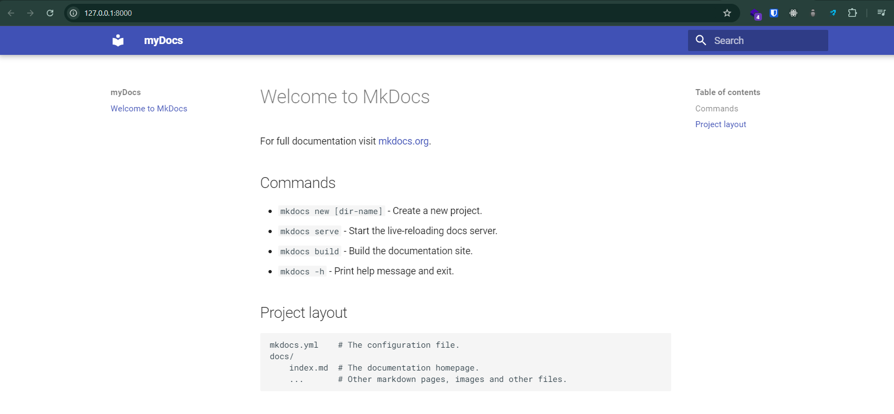
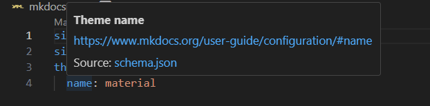

## Reources
- https://jameswillett.dev/getting-started-with-material-for-mkdocs/#add-line-numbers
- https://www.youtube.com/watch?v=xlABhbnNrfI&t=0s

## Basic setup and Installation Windows (CMD)
1. Check Python version ```where python``` and ```where python3```
2. Create a python virtual enviroment using ```python -m venv venv```
3. To activate that enviroment we will run ```.venv/Scripts/activate``` or ```venv\Scripts\activate``` or in bash ```source venv/Scripts/activate```
4. Check the pip version using ```pip --version```
5. Now we can install MkDocs ```pip install mkdocs-material```
6. in VsCode check you are in venv
7. Create my new mkdocs site by ```mkdocs new .```
8. Note: new docs folder and mkdocs.yml have been created
9. In the yml file add the following basic config
   ```
   site_name: myDocs
   site_url: https://docs.natnael.dev
   theme:
     name: material
    ```
10. Save the file
11. In the terminal do ```mkdocs serve```
12. you should see your site running on local host on a given port 

Just like that we have our basic doc up and running


## Modification to the basic mkdocs (CMD)
To get the most out of mkdocs material we need to make more changes to the mkdocs.yml file.

1. It is easy to make mistakes or error when updating yml file. which is why we will install material for mkdocs schema to clear or prevent error in our yml file.
2. Make sure yaml by Redhut extensiion is installed on your VSCode  
3. Add the following at the bottom of the settings.json file with in the first {} and add comma to the previous line if it doesnt have one:
```
 "yaml.schemas": {
    "https://squidfunk.github.io/mkdocs-material/schema.json": "mkdocs.yml"
  },
  "yaml.customTags": [
    "!ENV scalar",
    "!ENV sequence",
    "!relative scalar",
    "tag:yaml.org,2002:python/name:material.extensions.emoji.to_svg",
    "tag:yaml.org,2002:python/name:material.extensions.emoji.twemoji",
    "tag:yaml.org,2002:python/name:pymdownx.superfences.fence_code_format"
  ]
```
4. After this hovering over the lines in the mkdocs should show you


## Adjust Color Scheme
We can easily change the color scheme of our documentation.

Switch to Dark Mode
Start by changing the color scheme to ⚫ dark. Add this to the mkdocs.yml file: mkdocs.yml

```
theme:
  name: material
  palette:
    scheme: slate
```

### Primary Colour
Let's also change the primary colour in our documentation to 🟢 green by adding primary: green under the palette: mkdocs.yml

```
theme:
  name: material
  palette:
    scheme: slate
    primary: green
```

We can see that this makes the banner green, and also the hyperlinks green.

### Accent Colour
Let's also change the accent colour to 🟣 deep purple : mkdocs.yml

```
theme:
  name: material
  palette:
    scheme: slate
    primary: green
    accent: deep purple
```

Now when we hover over the links with the mouse, they turn purple.

### Toggle Light/Dark Modes
We can also add a toggle to our site that allows the user to switch between ⚪ light and ⚫ dark modes. Add this to palette in the mkdocs.yml file to enable this: mkdocs.yml

```
theme:
  name: material
  palette:
    # Dark Mode
    - scheme: slate
      toggle:
        icon: material/weather-sunny
        name: Dark mode
      primary: green
      accent: deep purple

    # Light Mode
    - scheme: default
      toggle:
        icon: material/weather-night
        name: Light mode
      primary: blue
      accent: deep orange
```

There are lots of other configuration options available to you in Material for MkDocs if you want to adjust the colour, for example adding custom colours or automatically switching between light and dark mode based on the time of day.

For more information, check the colors documentation page.

### Adjust Font
Material for MkDocs supports any Google font directly out of the box.

#### Default Font
Let's change the default font to Merriweather Sans:mkdocs.yml

```
theme:
  font:
    text: Merriweather Sans
```

#### Code Font
We can also change the font of the code in our docs: mkdocs.yml

```
theme:
  font:
    text: Merriweather Sans
    code: Red Hat Mono
```

If you want to add additional fonts beyond Google fonts, or change other font configuration, do check the Material font documentation

### Emojs

Material for MkDocs offers the possibility of using over 10,000 emojis and icons in your documentation with minimal configuration.

Browse through all available emojis and icons on the Material Emoji Documentation.

To add the ability to use these to your documentation portal, add this config to your mkdocs.yml: mkdocs.yml

```
markdown_extensions:
  - attr_list
  - pymdownx.emoji:
      emoji_index: !!python/name:material.extensions.emoji.twemoji
      emoji_generator: !!python/name:material.extensions.emoji.to_svg
```
Then simply add a sentence to any of your documentation files (e.g.index.md) with the emoji or icon code.

### Logos and Icons
Now that we have emojis and icons setup in our documentation, we can easily change the logo of our site.

#### Setting Logo to an Icon
Search for a suitable icon for your logo (for example solid-w).

Change the icon by making this change to the mkdocs.yml mkdocs.yml

```
theme:
  icon:
    logo: fontawesome/solid/w
```

#### Setting Logo to an Image
If you would prefer to set the logo of your site to your own custom image, follow these steps:

Inside the docs folder create an assets folder.
Add the logo.png file to this folder (i.e. the file with the logo you want to use)
Now change mkdocs.yml to: mkdocs.yml

```
theme:
  logo: assets/logo.png
```

#### Setting the Favicon
We can also set the Favicon for our site in a similar way:

First add the favicon.ico file to the assets folder we just created.
Then adjust mkdocs.yml to: mkdocs.yml

```
theme:
  favicon: assets/favicon.ico
```

You can change other icons on your MkDocs Material site in a similar way, but if you want to know more check the Material Logo and Icons Documentation.

### Code Blocks
One of the best features of Material for MkDocs is it's ability to display code in a clear, crisp and distinctive manner.

- Create a new page in your documentation called code-examples.md.
- Add the following example  Python code: code-examples.md

```
# Function to add two numbers
def add_two_numbers(num1, num2):
    return num1 + num2

# Example usage
result = add_two_numbers(5, 3)
print('The sum is:', result)
```
The code will display in a code block in the documentation portal, but won't have syntax colouring. To enable syntax colouring, add this extra configuration to our mkdocs.yml:

mkdocs.yml
```
markdown_extensions:
  - pymdownx.highlight:
      anchor_linenums: true
      line_spans: __span
      pygments_lang_class: true
  - pymdownx.inlinehilite
  - pymdownx.snippets
  - pymdownx.superfences
```
The previous code block we added will now be nicely highlighted.

If you want to add code in another language, find the lexers (short names for the language) on this [pygments](https://pygments.org/docs/lexers/#lexers-for-javascript-and-related-languages) page. For example:
 - Typescript
 - Java
 - GoLang

### Add Title
Add a title to the codeblock by typing py title="add_numbers.py":
Code block with title

```
```py title="add_numbers.py" 
# Function to add two numbers
def add_two_numbers(num1, num2):
    return num1 + num2

# Example usage
result = add_two_numbers(5, 3)
print('The sum is:', result)
```

```
code_examples.md

# Function to add two numbers
def add_two_numbers(num1, num2):
    return num1 + num2

# Example usage
result = add_two_numbers(5, 3)
print('The sum is:', result)

```
### Add Line Numbers
Add line numbers by typing py linenums="1":

Code block with line numbers

```
```py title="add_numbers.py" linenums="1"
# Function to add two numbers
def add_two_numbers(num1, num2):
    return num1 + num2

# Example usage
result = add_two_numbers(5, 3)
print('The sum is:', result)
```
code_examples.md

```
# Function to add two numbers
def add_two_numbers(num1, num2):
    return num1 + num2

# Example usage
result = add_two_numbers(5, 3)
print('The sum is:', result)
```

You can also start the line numbers from a different number e.g. py linenums="5"

### Highlight Lines
To highlight lines type py hl_lines="2-4".

Here is another codeblock to show this:

Highlight Lines

```
```js title="code-examples.md" linenums="1" hl_lines="2-4"
// Function to concatenate two strings
function concatenateStrings(str1, str2) {
  return str1 + str2;
}

// Example usage
const result = concatenateStrings("Hello, ", "World!");
console.log("The concatenated string is:", result);
```
code-examples.md

```
// Function to concatenate two strings
function concatenateStrings(str1, str2) {
  return str1 + str2;
}

// Example usage
const result = concatenateStrings("Hello, ", "World!");
console.log("The concatenated string is:", result);
```

### Content Tabs
Content tabs are useful when you want to group alternative content together. To enable content tabs add the following to the mkdocs.yml file: mkdocs.yml

```
markdown_extensions:
  - pymdownx.superfences
  - pymdownx.tabbed:
      alternate_style: true
```

- Create a new page called content-tabs.md
- Add the following to show generic content tabs: content-tabs.md

```
## Content Tabs

This is some examples of content tabs.

### Generic Content

=== "Plain text"

    This is some plain text

=== "Unordered list"

    * First item
    * Second item
    * Third item

=== "Ordered list"

    1. First item
    2. Second item
    3. Third item
```

Here is an example with different code blocks: content-tabs.md

```
### Code Blocks in Content Tabs

=== "Python"

    ```py
    def main():
        print("Hello world!")

    if __name__ == "__main__":
        main()
    ```

=== "JavaScript"

    ```js
    function main() {
        console.log("Hello world!");
    }

    main();
    ```
```

### Admonitions (aka Callouts)
Admonitions - also known as callouts - are great for highlighting parts of the documentation.

To enable them, add this configuration to the mkdocs.yml: mkdocs.yml

```
markdown_extensions:
  - admonition
  - pymdownx.details
  - pymdownx.superfences
```

- Create a new page called admonitions.md
- This is an example of an adominition with a title:

```
!!! note "Title of the callout"

    Lorem ipsum dolor sit amet, consectetur adipiscing elit. Nulla et euismod
    nulla. Curabitur feugiat, tortor non consequat finibus, justo purus auctor
    massa, nec semper lorem quam in massa.
```

```
Title of the callout

Lorem ipsum dolor sit amet, consectetur adipiscing elit. Nulla et euismod nulla. Curabitur feugiat, tortor non consequat finibus, justo purus auctor massa, nec semper lorem quam in massa.

```

### Collapsible Admonitions
You can also have a collapisble admonition:


Collapsible callout:

```
??? info "Collapsible callout"

    Lorem ipsum dolor sit amet, consectetur adipiscing elit. Nulla et euismod
    nulla. Curabitur feugiat, tortor non consequat finibus, justo purus auctor
    massa, nec semper lorem quam in massa.
```

Collapsible callout
Check the Admonitions documentation for other examples of admonitions you can use.

## Diagrams
Material for MkDocs allows you to easily implement statically rendered diagrams in your documentation. Examples of diagrams you might include are:

- [Flow charts](https://squidfunk.github.io/mkdocs-material/reference/diagrams/#using-flowcharts)
- [Sequence diagrams](https://squidfunk.github.io/mkdocs-material/reference/diagrams/#using-sequence-diagrams)
- [State diagram](https://squidfunk.github.io/mkdocs-material/reference/diagrams/#using-state-diagrams)s
- [Class diagrams](https://squidfunk.github.io/mkdocs-material/reference/diagrams/#using-class-diagrams)
- [Entity-relationship diagrams](https://squidfunk.github.io/mkdocs-material/reference/diagrams/#using-entity-relationship-diagrams)

To enable diagrams add this configuration to the mkdocs.yml:mkdocs.yml

```
markdown_extensions:
  - pymdownx.superfences:
      custom_fences:
        - name: mermaid
          class: mermaid
          format: !!python/name:pymdownx.superfences.fence_code_format
```

- Create a new page called diagram-examples.md
- Here is a flowchart example: diagram-examples.md

```
    # Diagram Examples

    ## Flowcharts

    ```mermaid
    graph LR
    A[Start] --> B{Failure?};
    B -->|Yes| C[Investigate...];
    C --> D[Debug];
    D --> B;
    B ---->|No| E[Success!];
    ```
```
This is a sequence diagram example: diagram-examples.md

```
    ## Sequence Diagrams

    ```mermaid
    sequenceDiagram
    autonumber
    Server->>Terminal: Send request
    loop Health
        Terminal->>Terminal: Check for health
    end
    Note right of Terminal: System online
    Terminal-->>Server: Everything is OK
    Terminal->>Database: Request customer data
    Database-->>Terminal: Customer data
    ```
```
Remember to check the diagrams documentation for further diagram examples.

## Footer
We can enable the navigation footer by adding the following to the mkdocs.yml:

mkdocs.yml
```
theme:
  features:
    - navigation.footer
```

You might want to add social icons to your footer like this: mkdocs.yml

```
extra:
  social:
    - icon: simple/youtube
      link: https://youtube.com/@james-willett
    - icon: simple/linkedin
      link: https://linkedin.com/in/willettjames
```

And you can add the copyright notice: mkdocs.yml

```
copyright: Copyright &copy; 2024 James Willett
```

# Optional Step
## Publish site to GitHub Pages
In order to publish our site on GitHub Pages, first create the .github/workflows/ci.yml file and paste in the example code:

.github/workflows/ci.yml

```
name: ci
on:
  push:
    branches:
      - master
      - main
permissions:
  contents: write
jobs:
  deploy:
    runs-on: ubuntu-latest
    steps:
      - uses: actions/checkout@v4
      - name: Configure Git Credentials
        run: |
          git config user.name github-actions[bot]
          git config user.email 41898282+github-actions[bot]@users.noreply.github.com
      - uses: actions/setup-python@v5
        with:
          python-version: 3.x
      - run: echo "cache_id=$(date --utc '+%V')" >> $GITHUB_ENV
      - uses: actions/cache@v4
        with:
          key: mkdocs-material-${{ env.cache_id }}
          path: .cache
          restore-keys: |
            mkdocs-material-
      - run: pip install mkdocs-material
      - run: mkdocs gh-deploy --force
```

- Create a brand new GitHub repository
- Hook up that GitHub repository remote with the project code (i.e. do git init then follow instructions to add the remote)
- Push branch to main on the GitHub repository
- Go to GitHub and into settings and change pages to deploy from branch, choose the gh-pages branch.
- A GitHub Action will trigger that deploys the site
  - For example https://james-willett.github.io/mkdocs-material-tutorial-2024/