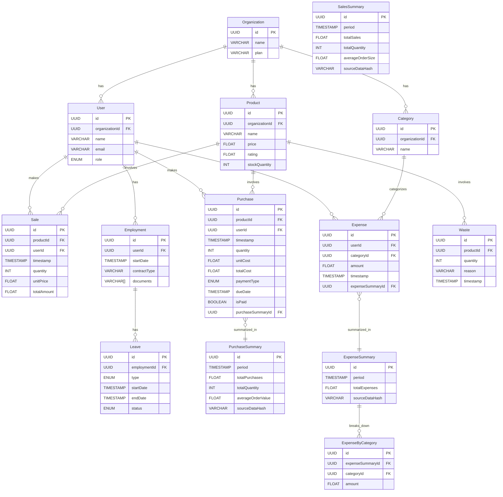

import { Steps } from '@astrojs/starlight/components';

# Database Schema

```mermaid
erDiagram
    Organization ||--o{ User : has
    Organization ||--o{ Product : has
    Organization ||--o{ Category : has
    User ||--o{ Sale : makes
    User ||--o{ Purchase : makes
    User ||--o{ Expense : records
    User ||--o{ Employment : has
    Product ||--o{ Sale : involves
    Product ||--o{ Purchase : involves
    Product ||--o{ Waste : involves
    Category ||--o{ Expense : categorizes
    Employment ||--o{ Leave : has
    Purchase }o--|| PurchaseSummary : summarized_in
    Expense }o--|| ExpenseSummary : summarized_in
    ExpenseSummary ||--o{ ExpenseByCategory : breaks_down

    Organization {
        UUID id PK
        VARCHAR name
        VARCHAR plan
    }

    User {
        UUID id PK
        UUID organizationId FK
        VARCHAR name
        VARCHAR email
        ENUM role
    }

    Product {
        UUID id PK
        UUID organizationId FK
        VARCHAR name
        FLOAT price
        FLOAT rating
        INT stockQuantity
    }

    Category {
        UUID id PK
        UUID organizationId FK
        VARCHAR name
    }

    Sale {
        UUID id PK
        UUID productId FK
        UUID userId FK
        TIMESTAMP timestamp
        INT quantity
        FLOAT unitPrice
        FLOAT totalAmount
    }

    Purchase {
        UUID id PK
        UUID productId FK
        UUID userId FK
        TIMESTAMP timestamp
        INT quantity
        FLOAT unitCost
        FLOAT totalCost
        ENUM paymentType
        TIMESTAMP dueDate
        BOOLEAN isPaid
        UUID purchaseSummaryId FK
    }

    Expense {
        UUID id PK
        UUID userId FK
        UUID categoryId FK
        FLOAT amount
        TIMESTAMP timestamp
        UUID expenseSummaryId FK
    }

    Waste {
        UUID id PK
        UUID productId FK
        INT quantity
        VARCHAR reason
        TIMESTAMP timestamp
    }

    Employment {
        UUID id PK
        UUID userId FK
        TIMESTAMP startDate
        VARCHAR contractType
        VARCHAR[] documents
    }

    Leave {
        UUID id PK
        UUID employmentId FK
        ENUM type
        TIMESTAMP startDate
        TIMESTAMP endDate
        ENUM status
    }

    SalesSummary {
        UUID id PK
        TIMESTAMP period
        FLOAT totalSales
        INT totalQuantity
        FLOAT averageOrderSize
        VARCHAR sourceDataHash
    }

    PurchaseSummary {
        UUID id PK
        TIMESTAMP period
        FLOAT totalPurchases
        INT totalQuantity
        FLOAT averageOrderValue
        VARCHAR sourceDataHash
    }

    ExpenseSummary {
        UUID id PK
        TIMESTAMP period
        FLOAT totalExpenses
        VARCHAR sourceDataHash
    }

    ExpenseByCategory {
        UUID id PK
        UUID expenseSummaryId FK
        UUID categoryId FK
        FLOAT amount
    }
```